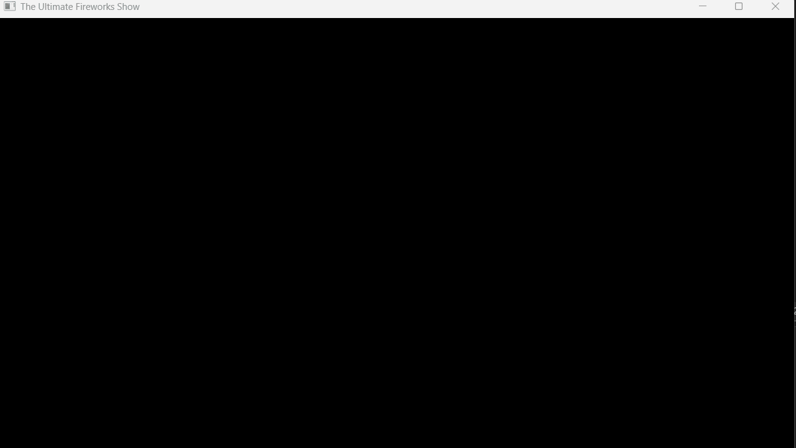

# 🎆 The Ultimate Polymorphic Fireworks Show

A high-performance, physics‑based fireworks simulation built with **C++** and **SFML 3.0**.  
This project showcases modern C++ architecture with a strong focus on **OOP**, **polymorphism**, and **RAII**.



---

## 🚀 Overview

The simulation is powered by a polymorphic particle system where every visual element is an independent object governed by simple physics laws:

- **Rockets** launch with upward velocity, leaving a fading trail.
- **Sparks** are spawned on rocket death and disperse in all directions.
- **Gravity & drag** create natural-looking arcs and smooth deceleration.
- **Additive blending** gives bright, glowing explosions that layer beautifully on top of each other.

The result is a clean, extensible sandbox for experimenting with real-time rendering and game‑style architecture in Modern C++.

---

## 🛠 Tech Stack & Key Concepts

- **Language:** C++ (C++20 standard)
- **Graphics Library:** SFML 3.0 (Simple and Fast Multimedia Library)
- **Platform:** Desktop
- **IDE:** Visual Studio (solution-based workflow)

### Core Engineering Concepts Implemented

1. **Polymorphism & Inheritance**
   - Abstract base class `Particle` defines the common interface.
   - Derived classes like `Rocket` and `Spark` override `update()` and `draw()` with their own behaviors.
   - The main loop only works with `Particle*` / `std::unique_ptr<Particle>`, never with concrete types.

2. **Smart Memory Management (RAII)**
   - Strict use of `std::unique_ptr` to manage particles.
   - No manual `new` or `delete` calls in user code.
   - Particle lifetime is fully owned by STL containers, embracing the **Rule of Zero**.

3. **Modern STL Algorithms**
   - Particles are stored in `std::vector<std::unique_ptr<Particle>>`.
   - Dead particles are removed each frame using the **Erase–Remove Idiom** via `std::erase_if`.

4. **Simple Physics Engine**
   - **Euler integration** for motion: `position += velocity` each frame.
   - Gravity: `velocity.y += gravity` to simulate falling sparks.
   - Circular explosions use `std::sin` / `std::cos` to compute evenly distributed directions.

---

## 💻 Code Highlight – Polymorphism in Action

The core update logic never needs to know which specific particle type it is handling:

```cpp
// 1. Polymorphic update
for (auto& p : particles) {
    p->update();           // virtual dispatch to Rocket::update or Spark::update
}

// 2. Handle rocket explosions on death
if (p->isDead()) {
    // Check if the particle that just died was a Rocket
    if (auto* rocket = dynamic_cast<Rocket*>(p.get())) {
        createExplosion(rocket->getPosition(), rocket->getColor());
    }
}

// 3. Automatic cleanup of dead particles
std::erase_if(particles, [](const auto& p) {
    return p->isDead();
});
```

This pattern keeps the main loop **simple**, **generic**, and **easy to extend**.  
To add a new particle type, you implement a new class deriving from `Particle` and push it into the container — no changes are required in the main loop.

---

## 🧩 Design Goals

- **Showcase clean polymorphic design** suitable for interviews and portfolios.
- **Demonstrate RAII & smart pointers** in a real-time context.
- **Provide a small, focused playground** for experimenting with SFML rendering and basic physics.
- **Make extension easy** — new particle types, colors, or explosion patterns can be added with minimal friction.

---

## ⚙️ How to Build & Run

### 1. Requirements

- A C++20-compatible compiler.
- [SFML 3.0](https://www.sfml-dev.org/) libraries (graphics, window, system).
- Visual Studio (recommended) or another IDE/CMake setup.

### 2. Clone the Repository

```bash
git clone https://github.com/<your-username>/Ultimate-Polymorphic-Fireworks.git
cd Ultimate-Polymorphic-Fireworks
```

### 3. Configure SFML in Visual Studio

1. Open the provided solution in **Visual Studio**.
2. In *Project Properties*:
   - Add SFML **Include** directory to `C/C++ → General → Additional Include Directories`.
   - Add SFML **Library** directory to `Linker → General → Additional Library Directories`.
3. Link against the required SFML libraries in `Linker → Input → Additional Dependencies`
   (e.g., `sfml-graphics.lib`, `sfml-window.lib`, `sfml-system.lib`).

### 4. Copy SFML DLLs

Copy the SFML runtime DLLs (such as `sfml-graphics-3.dll`, `sfml-window-3.dll`, `sfml-system-3.dll`)  
into the same folder as the executable (for example: `x64/Debug` or `x64/Release`).

### 5. Build & Run

- Select the configuration (**Debug** / **Release**, **x64**).
- Build the solution.
- Run the executable — enjoy the fireworks 🎆

---

## 🔮 Possible Extensions

If you want to evolve this project further, here are some ideas:

- Different explosion styles (rings, spirals, randomized bursts).
- Color gradients over particle lifetime.
- Sound effects synchronized with explosions.
- Simple UI for tweaking gravity, number of particles, and explosion size at runtime.
- Recording GIFs or screenshots automatically for your portfolio.

---

## 👨‍💻 About

Built by **Ran Almagor** — a software developer passionate about **Modern C++**,  
**high-performance simulations**, and writing clean, extensible code.

If you like this project, consider ⭐ starring the repository and using it as a base for your own experiments.
